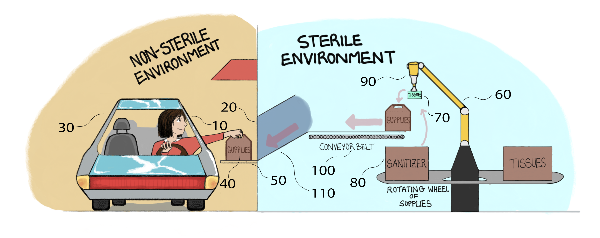

# Welcome to the Solve Hunger Program Site!
{: .display-4}
 
We are a small group of individuals focused on building tools and solutions for solving hunger. We bring to bear bleeding edge technologies such as Robotics, A.I. , IoT and the Cloud to solve this problem. We are currently working in the city of Detroit. Our solutions are designed to be used across the world.
{: .welcomefont}

{:style="max-width: 100%; height: auto;"}
We are working on projects to solve hunger, energy and health among others. Our primary tool is technology, but we also draw upon the behavioral sciences to design our solutions.

{: .welcomefont}

We are a Global organization with roots in Detroit, Ann Arbor and Automation Alley in Michigan.
{: .welcomefont}

The scale of problems we wish to tackle is large and only together can we solve them. Our projects are looking for passionate, committed individuals. We have roles for technical experts, project managers, research managers, execution specialists and fellows. Please explore below to find out if you would like to help move the needle on any of them!
{: .welcomefont}
